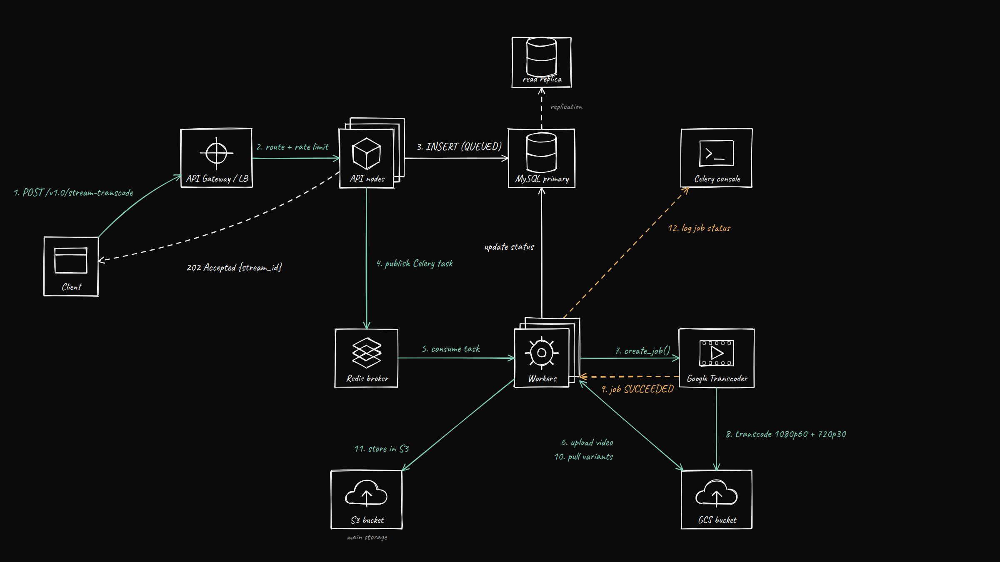

# Transcoding Microservice: Technical Documentation

A Django API that takes one MP4 upload, stores the original in S3, transcodes it with Google Transcoder into 1080p 60fps and 720p 30fps, and puts both versions back in S3 next to the original. The slow work runs in Celery workers, so the API replies right away with 202 Accepted.

---

## 1. Problem statement

The design criteria and how this version addresses them:

- Single API Endpoint: Single POST endpoint for uploading video files.

- Validates content type, size, max 2 GB, and the MP4 file header.

- Duplicate files, with the same SHA-256 hash, are not transcoded again. The existing result is returned. If the earlier attempt failed, it is retried.

- Slow work, such as creating the Transcoder job, waiting for it and copying outputs to S3, runs in Celery workers.

- Video conversion: Produces two output variants: 1080p at 60 fps and 720p at 30 fps.

- GCS is only temporary staging, because Google Transcoder can only read and write GCS. This video's files are deleted from GCS after they are copied to S3.

- The original and both outputs are stored in S3 in the same folder.

- Handle the same video uploaded by different users while maintaining consistency and data integrity. Note: This criterion is under consideration and is not implemented in v1.0.

---

## 2. System Architecture



**Reasons behind the thinking:**

- **Asynchronous in mind:** This design was chosen for scalability, as it is important not to hold connections open for too long or block the main thread. The view completes the steps needed to validate and accept the uploaded stream, then passes the necessary information to a background worker for processing. The view handles validation, hashing, uploading the original file, storing the video details in the database, and replying with 202 Accepted. The remaining I/O bound work runs in Celery workers, and the CPU intensive transcoding itself runs on google transcoding api server, separate from the main system.


- **Redis in the background:** Redis was chosen not only for easy integration, but because it is a suitable broker for Celery for this workload and avoids overengineering.

- **The database is the single source of truth for job state:** The API and worker nodes keep no state of their own, everything relevant is stored in the database. This means we can add more of either as needed, which is important for scaling in production.

**Reference:** [Automate Your VOD Transcoding at Scale with GCP, Part 1](https://medium.com/google-cloud/automate-your-vod-transcoding-at-scale-with-gcp-part-1-87503fdd3a9f), [Part 2](https://medium.com/google-cloud/automate-your-vod-transcoding-at-scale-with-gcp-part-2-b1da0e57823d)

---

## 3. Database Design

### Architecture Overview

The system has been divided into two database tables for easy storage and access. The application uses an abstract base model to keep consistent common fields on every inherited model. The data is split into two related tables, Stream and StreamVariant.

### `BaseModel`, abstract

```python
class BaseModel(models.Model):
    id = models.UUIDField( primary_key = True , default = uuid.uuid4 , editable = False)
    created_at = models.DateTimeField( auto_now_add = True )
    updated_at = models.DateTimeField( auto_now = True)

    class Meta:
        abstract = True
```
### `Stream` model

```python
class Stream(BaseModel):
    status = models.CharField( max_length = 30 , choices = StreamStatus.choices , db_index = True , default = StreamStatus.QUEUED )
    content_hash = models.CharField( max_length =  64, unique = True, editable = False , blank = True , null = True)
    output_uri = models.CharField(max_length=1024, blank=True, default="")
    gcs_uri = models.CharField(max_length=255, unique=True, null=True, blank=True)
    s3_uri = models.CharField(max_length=255, blank=True, default="")
    job_name = models.CharField( max_length = 255 , unique = True , null = True , blank = True ,  editable = False )
    error = models.TextField(  default = "" , blank = True )
```


### `StreamVariant` model

```python
class StreamVariant(BaseModel):
    stream = models.ForeignKey( Stream  , on_delete = models.CASCADE , related_name = "variants")
    resolution = models.CharField( max_length=30)
    fps = models.PositiveIntegerField()
    uri = models.CharField( max_length = 255 )

```

---

## 4. API Design

### `POST /api/v1.0/stream-transcode/`

Accepts `multipart/form-data`.

**Request flow inside the view:**

```
1. Validate: content type, size, max 2 GB, MP4 file header
2. Hash the file, SHA-256, in chunks
3. Look up the hash in the DB
     → found, not failed: return it, 200, "duplicate": true
     → found, failed: reset to QUEUED and queue the job again
     → not found: continue
4. Upload the original to S3
5. Upload the original to GCS, temporary
6. Save the Stream row, status = queued
7. After commit, send create_transcode_job to Celery
8. Return 202 Accepted with id and status
```

- **Stream hashing:** Hashing happens before any network call, and the file is hashed after it reaches the server but before it is sent to S3/GCS. This saves storage uploads and Transcoder cost for duplicates, but not the client's upload bandwidth.
- **Race conditions:** This prevents race conditions and keeps the system stable. Without wrapping the Celery dispatch in `transaction.on_commit`, if Celery picks up the task before Django's transaction has committed, it will attempt to read the Stream row from the database, resulting in a DoesNotExist error in the worker. Dispatching the task only after the commit makes sure the row is visible to any process reading it.

### Response shapes


**202 Accepted**, new upload
```json
{ "id": "<stream-uuid>", "status": "queued", ... }
```

**200 OK**, same file uploaded again
```json
{ "id": "<stream-uuid>", "status": "complete", "duplicate": true }
```

**400 Bad Request**, invalid file
```json
{ "video_files": ["File content does not match a valid MP4 format"] }
```

**500 Internal Server Error**, storage or DB error
```json
{ "error": { "message": "Upload failed." } }
```
**200 Completed**, 
```json
{
    "id": "acc7f7ef-3457-4559-ad54-278a532e42f6",
    "status": "complete",
    "duplicate": true,
    "variants": [
        {
            "id": "2f32fdde-4afa-46e3-b0b0-df31b1aeb22f",
            "created_at": "2026-09-28T03:34:07.155565-05:00",
            "updated_at": "2026-09-28T03:34:07.155624-05:00",
            "resolution": "1080p",
            "fps": 60,
            "uri": "s3://clyapp-s3-video-storage/videos/acc7f7ef-3457-4559-ad54-278a532e42f6_1080p_60fps_video.mp4",
            "stream": "acc7f7ef-3457-4559-ad54-278a532e42f6"
        },
        {
            "id": "355f880e-c84a-441e-9ec0-0c0cce3871c0",
            "created_at": "2026-09-28T03:34:22.238304-05:00",
            "updated_at": "2026-09-28T03:34:22.238333-05:00",
            "resolution": "720p",
            "fps": 30,
            "uri": "s3://clyapp-s3-video-storage/videos/acc7f7ef-3457-4559-ad54-278a532e42f6_720p_30fps_video.mp4",
            "stream": "acc7f7ef-3457-4559-ad54-278a532e42f6"
        }
    ]
}
```

---

## 5. Concurrency & Edge Cases


### Duplicate uploads
content_hash has a database level unique=True constraint. The application level check runs beforehand to optimize and avoid wasted uploads. However, if a race condition occurs, `serializer.save` raises an IntegrityError, which is caught so the existing record is returned instead of crashing.

**Reference:** [Django, Controlling transactions explicitly](https://docs.djangoproject.com/en/6.1/topics/db/transactions/#controlling-transactions-explicitly), [The Perils of get_or_create: Race Conditions](https://adriennedomingus.com/tech/the-perils-of-getorcreate-race-conditions/), [How Django Transactions Work](https://m-t.a.medium.com/python-how-django-transactions-work-a87083303102)


### Concurrency
The Transcoder enforces a quota on concurrent jobs per project and region, and jobs fail once that quota is reached. To address this:

- Jobs exceeding the concurrency limit remain in the Celery queue instead of being rejected. Requests wait for their turn during normal traffic spikes.

- We could also limit user video uploads. However, relying solely on a video count limit is not ideal, since video sizes range from small clips to large files.


### Large files / memory
Uploads above Django's in memory limit are spooled to a temp file, and the
worker streams outputs from GCS to S3 in chunks, so a 2 GB file is never
fully loaded into memory.

### File validation
The serializer checks the real MP4 header, the magic bytes, not only the
content type or extension, because both can be spoofed.

* References: **[The Usual Suspect: Type Confusion in Twelve Bytes, Voorivex Team](https://blog.voorivex.team/usual-suspect-type-confusion-in-twelve-bytes):** A detailed look at how file type validation can be tricked by manipulating the first twelve bytes of a file, using magic bytes and polyglots.

* **[File Upload Bypasses, BBLabs Academy](https://bblabs.es/en/academy/intermedio/file-upload-bypasses-completo):** Detailed analysis on bypassing file upload restrictions using extension manipulation, content type spoofing, and malicious payloads.


### Malware / Antivirus Scanning

Antivirus scanning could be added as a Celery background task that runs before transcoding.

### Serve via a CDN with a separate domain

To reduce latency and speed up loading, the output videos could be served through a CDN.

---

## 6. Setup and Docker
```
git clone {_repository_}
cd video_transcode_api
```
```
cp .env.example .env
```
```
cp gcp-service-account.example.json gcp-service-account.json
```
```
docker compose --env-file .env up -d --build
```
```
docker compose exec web python manage.py makemigrations
```
```
docker compose exec web python manage.py migrate
```
```
docker compose logs -f
```
```
python scripts/api_client.py   
```
---

## 7. Code Organization

```
core/                    # Django project package: settings, urls, celery app
transcoder/              # Django app: all business logic lives here
├── models.py            # BaseModel, Stream, StreamVariant (schema)
├── serializers.py       # DRF serialization
├── constants.py         # MAX_FILE_SIZE, read-only fields
├── utils.py             # SHA-256 hashing, file type check, path helper
├── views.py             # StreamAPIView, the constrained entry point
├── tasks.py             # Celery tasks: job creation + status polling
├── tests.py            
└── services/
    ├── gcs_client.py            # GCS upload, streaming read, delete this video's files
    ├── s3_client.py             # S3 upload (multipart, streaming)
    ├── transcode_task.py        # create job, check status, copy outputs to S3
    └── transcoder_config.json   # 1080p60 and 720p30 job config
```

## Why the code is more than 100 lines

I first wrote everything in a single `main.py` to stay under 100 lines. It worked, but the view, the Celery tasks, and the S3, GCS and Transcoder calls were all mixed together, which made it hard to read and to test.

So I split it into small files, each with one job. The total is longer than 100 lines, but each file is short and easy to follow. This was a deliberate tradeoff, clean and separate concerns and scalability over a specific line count.

## References

- [Automate Your VOD Transcoding at Scale with GCP, Part 1](https://medium.com/google-cloud/automate-your-vod-transcoding-at-scale-with-gcp-part-1-87503fdd3a9f)
- [Celery Documentation: Retrying Tasks](https://docs.celeryq.dev/en/stable/userguide/tasks.html#retrying)
- [Django Documentation: Controlling Transactions Explicitly](https://docs.djangoproject.com/en/6.1/topics/db/transactions/#controlling-transactions-explicitly)
- [Django Documentation: Performing Actions After Commit](https://docs.djangoproject.com/en/6.1/topics/db/transactions/#performing-actions-after-commit)
- [Google Cloud Transcoder API](https://docs.cloud.google.com/transcoder/docs/concepts/config-examples)
- [Python: How Django Transactions Work](https://m-t.a.medium.com/python-how-django-transactions-work-a87083303102)
- [The Perils of get_or_create: Race Conditions](https://adriennedomingus.com/tech/the-perils-of-getorcreate-race-conditions/)